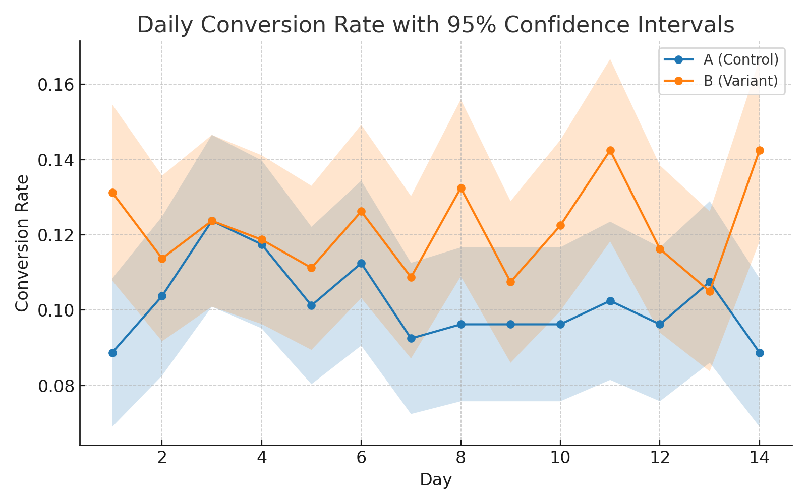

# 🧪 A/B Testing in Python

A hands-on project to simulate and analyze A/B test experiments using Python.  
Learn how to run statistical tests, compute confidence intervals, and visualize results with clear recommendations.

---

## 🚀 How to Run

1. **Clone this repo**

```bash
git clone https://github.com/Mikadataa/AB-Testing-Python.git
cd AB-Testing-Python
```

2. **Install dependencies**

```bash
pip install -r requirements.txt
```

3. **Run the notebook**

```bash
jupyter notebook notebooks/ab_test_analysis.ipynb
```

---

## 📊 Demo

Here’s a sample visualization of conversion rates with confidence intervals:



---

## 📚 What You'll Learn

- ✅ Simulate A/B test data  
- ✅ Compute conversion rates with confidence intervals  
- ✅ Run a two-proportion z-test  
- ✅ Visualize results with Matplotlib  
- ✅ Translate stats into plain-English recommendations  

---

## 🔮 Extensions (Next Steps)

- Add CTR, revenue per user, or retention as metrics  
- Use t-tests for continuous outcomes (e.g., time spent, order value)  
- Build a Streamlit dashboard for interactive analysis  
- Try Bayesian A/B testing approaches  

---

## 👩‍💻 Author

**Mikadataa**  
🔗 [LinkedIn](https://www.linkedin.com/in/smagulova/) | 🐙 [GitHub](https://github.com/Mikadataa)

---

## 📄 License

This project is licensed under the MIT License.
